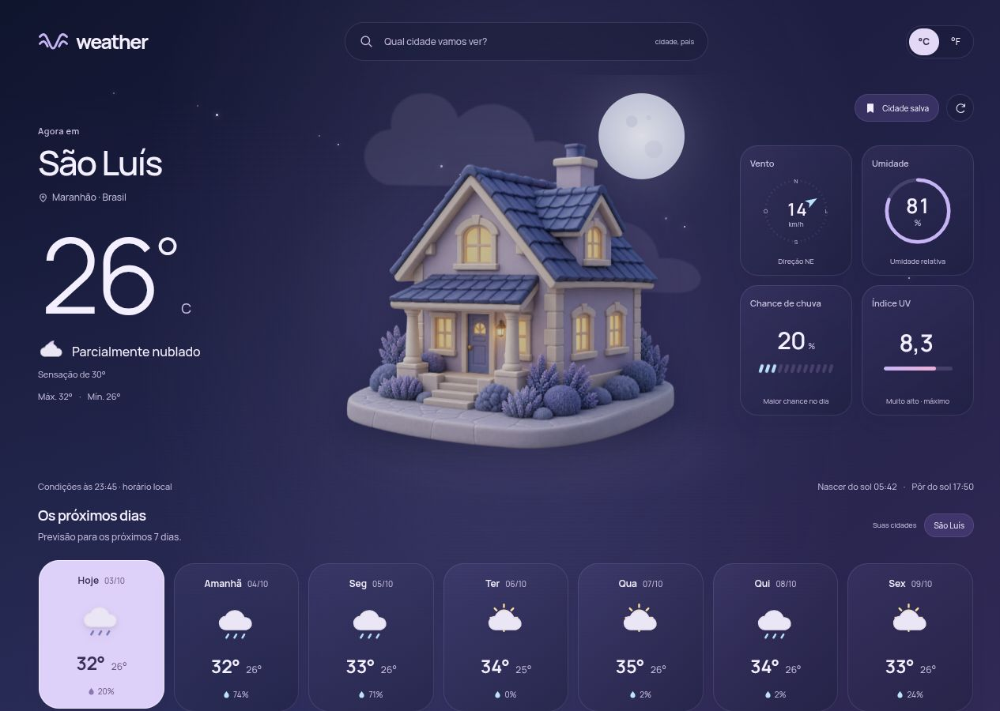

# Weather

Consulta de tempo criada por Giselly Pereira. Uma interface em português com uma cena de clima em camadas, casinha em 3D, painéis translúcidos, condições atuais, busca mundial de cidades e previsão por hora e para sete dias.

[Abrir o Weather](https://tourmaline-licorice-702b65.netlify.app/)



## Rodar

Node.js 22.12 ou superior.

```sh
npm install
npm run dev
```

```sh
npm run lint
npm test
npm run build
npm run preview
```

## A experiência

- São Luís aparece na primeira visita. A última cidade consultada é lembrada neste navegador.
- Busca com sugestões, navegação pelo teclado e seleção de cidade/região/país.
- Condições atuais, sensação térmica, umidade, vento e direção.
- Sete dias com mínima/máxima e chance de chuva. Selecionar um dia atualiza o cenário, o gráfico e seus detalhes. Hoje mostra a temperatura atual; nos demais dias, o destaque é a máxima prevista, identificada na interface.
- Previsão por hora com curva de temperatura, condição e chance de chuva.
- Alternância entre Celsius e Fahrenheit e até seis cidades salvas no navegador.
- Céu com nuvens, sol, lua, estrelas, chuva ou neve, de acordo com os dados retornados.
- Transições de cor de 1,35 segundo, movimento em camadas e leve paralaxe com o mouse, inspirados no [Soda Animation](https://github.com/GisellyPereira/soda-animation). A página mantém a rolagem normal.
- Temperaturas com interpolação suave, indicadores de umidade e vento e seleção de dias por teclado.
- Horários no fuso da cidade; cache de dez minutos, botão de atualização, cancelamento de consultas antigas e tratamento de falhas.
- Layout responsivo, foco visível, anúncios de status e respeito a `prefers-reduced-motion`.

## Dados e créditos

[Open-Meteo](https://open-meteo.com/) fornece as condições e previsões. A busca de cidades usa a API de geocodificação Open-Meteo, baseada em [GeoNames](https://www.geonames.org/). Os créditos ficam visíveis na interface. A previsão não é uma medição feita pelo aplicativo.

A API aberta atende ao uso não comercial conforme as [condições do provedor](https://open-meteo.com/en/terms). Não é necessária chave para desenvolvimento. A consulta depende de conexão com a internet; nenhuma previsão fictícia é apresentada como atual.

Tipografia: Manrope (SIL Open Font License). Marca e ícones em SVG, céu e animações produzidos para este projeto. A casinha foi criada com a ferramenta integrada de geração de imagens; arquivo e prompt registrados em [public/images/SOURCES.md](public/images/SOURCES.md). Sem fotografias de banco ou bibliotecas de ícones.

## Organização

`src/lib/weather.ts` integra e valida as APIs e transforma os dados. `src/lib/storage.ts` preserva preferências com fallback quando o armazenamento está bloqueado. Os componentes em `src/components` tratam busca, ilustração do céu e previsão por hora. `src/App.tsx` coordena as consultas e a tela. Não há backend nem segredo exposto no cliente.
